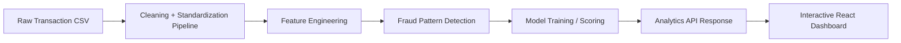

<div align="center">
  
<p align="center">
  
  
  
  
</p>

# BastiKaHasti ML: Fraud Detection Intelligence

<p align="center"><b>Pattern-aware fraud analytics&nbsp; ◦ &nbsp;Interactive dashboard&nbsp; ◦ &nbsp;CSV-to-insight pipeline&nbsp; ◦ &nbsp;Explainable model scoring</b></p>

<h4 align="center">
  <a href="#-introduction">📖 Introduction</a>&nbsp; • &nbsp;
  <a href="#-patterns-we-detect">🕵️ Patterns</a>&nbsp; • &nbsp;
  <a href="#-model-performance">📊 Model Performance</a>&nbsp; • &nbsp;
  <a href="#-frontend-experience">🖥️ Frontend</a>&nbsp; • &nbsp;
  <a href="#-usage">⚙️ Usage</a>&nbsp; • &nbsp;
  <a href="#-deployment">🚀 Deployment</a>
</h4>
  
</div>

**🔥 Highlights**
- **Full fraud workflow**: upload raw transaction CSVs, clean them, engineer features, detect fraud patterns, train models, and visualize the results.
- **Explainable fraud rules**: every suspicious transaction can be tied back to explicit business-style patterns, not just a black-box score.
- **Dashboard-ready API**: the backend returns dataset summaries, quality scoring, distributions, top risky transactions, confusion matrix, thresholds, and feature importance.
- **Hackathon-friendly storytelling**: this project is built to clearly show what was cleaned, what patterns were triggered, what the model learned, and how the UI helps investigators drill down.

**🧠 Core idea**
- **Rule + ML hybrid**: the system combines interpretable fraud patterns with machine learning.
- **Cleaning-first pipeline**: the model only works after standardizing dirty amounts, timestamps, cities, IPs, devices, and statuses.
- **Interactive investigation**: users can inspect distributions, filter by pattern, and click into risky transactions from the frontend.

---

# 📖 Introduction

Fraud datasets are rarely clean, and fraud detection is rarely just a modeling problem. The real challenge is building a pipeline that can:

- handle messy CSVs from the real world
- normalize inconsistent transaction fields
- detect suspicious behavioral patterns
- produce explainable fraud flags
- score transactions with machine learning
- return outputs that a frontend can actually visualize and investigate

This project does exactly that.

It combines a **FastAPI backend** and a **React + Vite frontend** into a fraud-intelligence system that accepts raw transaction files and returns:

- cleaned, model-ready data
- quality-of-data diagnostics
- fraud pattern summaries
- transaction-level fraud predictions
- model metrics and benchmark reports
- frontend-friendly distributions for charts and drilldowns

---

# 🎯 What The System Does

### Backend responsibilities

- Normalizes raw schema aliases
- Cleans:
  - transaction amounts
  - timestamps
  - user and merchant cities
  - payment methods
  - merchant categories
  - device identifiers
  - statuses
  - IP addresses
- Builds engineered fraud features
- Detects rule-based fraud patterns
- Trains and scores:
  - `Random Forest`
  - `XGBoost`
- Returns rich analytics payloads for the UI

### Frontend responsibilities

- Uploads CSVs
- Shows dataset summary and data quality
- Visualizes:
  - all city distributions
  - merchant city distributions
  - payment method distributions
  - merchant category distributions
  - device type distributions
  - fraud pattern counts
- Shows model performance cards
- Supports transaction drilldown and pattern-based filtering

---

# 🏗️ Architecture

Instead of treating this as only a model-training app, the project is designed as a **fraud intelligence pipeline**.



---

# 🕵️ Patterns We Detect

The current fraud rule engine uses **8 patterns**.

| Pattern | Meaning | Why it matters |
|---|---|---|
| `pattern_location_mismatch` | User city and merchant city do not match | Useful for spotting suspicious geographic behavior |
| `pattern_odd_hour_transaction` | Transaction happens between `12 AM` and `4 AM` with other suspicious context | Fraud often spikes during low-supervision hours |
| `pattern_high_amount_vs_balance` | Amount is unusually high relative to account balance | Captures draining behavior and risky spend |
| `pattern_unknown_device` | Device is unseen, malformed, or suspicious for that user | Strong account takeover signal |
| `pattern_failed_high_value` | High-value transaction fails | Often seen in fraud probing and card testing |
| `pattern_ip_risk` | Invalid IP, shared IP, or high IP traffic volume | Helps catch shared infrastructure abuse |
| `pattern_velocity` | Too many transactions in a short window | Useful for burst attacks and rapid retries |
| `pattern_post_failure_success` | Success occurs after a streak of failures | Classic attack-recovery pattern |

### Current tuned pattern logic

- **Velocity** is now stricter to reduce overfiring:
  - `txn_count_1min > 8`
  - or `txn_count_1h > 25` with `time_diff < 5`
- **Post-failure success** now requires:
  - `success` after at least `3` consecutive failures

This tuning helped reduce false aggressiveness on smaller sample files while keeping the 10k fraud dataset closely aligned with its intended label distribution.

---

# 📦 Engineered Features

The system does not rely only on raw columns. It derives fraud-focused features such as:

- `clean_amount`
- `account_balance`
- `txn_count_1min`
- `txn_count_1h`
- `time_diff`
- `consecutive_failures`
- `device_user_degree`
- `ip_velocity_all_users`
- `ip_user_degree`
- `payment_method_entropy_10m`
- `balance_depletion_ratio`
- `amount_to_balance_ratio`
- `is_cross_city`
- `hour`
- `is_odd_hour`
- `is_post_failure_success`
- `anomaly_score`

These become the bridge between raw transaction data and model-ready signals.

---

# 📊 Benchmark Pattern Summary

On the labeled benchmark file `transactions_10k_with_fraud.csv`, the tuned rule engine produced:

| Metric | Value |
|---|---:|
| Total rows | `10,000` |
| Source fraud labels | `3,454` |
| Tuned pipeline fraud flags | `3,435` |
| Tuned pipeline non-fraud flags | `6,565` |

### Pattern counts on the same benchmark

| Pattern | Trigger count |
|---|---:|
| `pattern_location_mismatch` | `2,060` |
| `pattern_odd_hour_transaction` | `1,156` |
| `pattern_unknown_device` | `506` |
| `pattern_failed_high_value` | `397` |
| `pattern_high_amount_vs_balance` | `237` |
| `pattern_post_failure_success` | `5` |
| `pattern_ip_risk` | `0` |
| `pattern_velocity` | `0` |

This is a much healthier result than the earlier over-aggressive rules, because the tuned fraud count stays very close to the dataset's actual fraud distribution.

---

# 🤖 Model Performance

The current benchmark below was run on:

- Dataset: `transactions_10k_with_fraud.csv`
- Rows used: `10,000`
- Feature count: `21`
- Target column: `raw_fraud_label`
- Label mode: `real`

### Model comparison

| Model | Accuracy | Precision | Recall | F1 | ROC-AUC |
|---|---:|---:|---:|---:|---:|
| Random Forest | `0.9480` | `0.9292` | `0.9184` | `0.9238` | `0.9798` |
| XGBoost | `0.9475` | `0.9291` | `0.9169` | `0.9230` | `0.9832` |

### Confusion matrix snapshot

#### Random Forest

| TN | FP | FN | TP |
|---:|---:|---:|---:|
| `1266` | `48` | `56` | `630` |

#### XGBoost

| TN | FP | FN | TP |
|---:|---:|---:|---:|
| `1266` | `48` | `57` | `629` |

### Full-dataset fraud predicted

| Model | Fraud predicted | Non-fraud predicted | Fraud rate |
|---|---:|---:|---:|
| Random Forest | `3,372` | `6,628` | `33.72%` |
| XGBoost | `3,387` | `6,613` | `33.87%` |

### Why these metrics matter

- **Accuracy** tells us overall correctness
- **Precision** tells us how many flagged frauds are truly fraud
- **Recall** tells us how many frauds we successfully catch
- **F1** balances precision and recall
- **ROC-AUC** tells us how well the model separates fraud from non-fraud across thresholds

For a hackathon demo, this is useful because it shows both:

- **interpretable fraud rules**
- **strong predictive performance**

---

# ⚡ Algorithms Used

## 1. Random Forest

Random Forest is an ensemble of decision trees trained on bootstrapped samples of the data.

### Why we use it

- strong baseline
- robust on tabular fraud data
- handles mixed numeric and categorical features well after preprocessing
- easy to compare against XGBoost

### Practical complexity

- Training is roughly proportional to:
  - number of trees
  - number of rows
  - number of features sampled per split
- In intuition terms:
  - **more trees = better stability, more compute**

## 2. XGBoost

XGBoost is a gradient-boosted tree algorithm that builds trees sequentially to correct prior errors.

### Why we use it

- one of the strongest tabular ML algorithms
- excellent for fraud scoring
- handles non-linear behavior well
- supports class imbalance tuning

### Practical complexity

- Training is roughly proportional to:
  - number of boosting rounds
  - number of rows
  - number of features
  - tree depth
- In intuition terms:
  - **more boosting rounds and deeper trees = more power, more compute**

### Current tuned XGBoost parameters

```python
XGBClassifier(
    n_estimators=450,
    max_depth=5,
    learning_rate=0.03,
    subsample=0.75,
    colsample_bytree=0.75,
    min_child_weight=5,
    gamma=1.0,
    reg_lambda=4.0,
    reg_alpha=0.5,
)
```

---

# 🖥️ Frontend Experience

The frontend is not just a file uploader. It is designed like a lightweight fraud investigation console.

### What the UI shows

- upload flow for raw CSVs
- KPI cards:
  - rows
  - columns
  - fraud counts
  - quality score
- data quality badge:
  - `good`
  - `warning`
  - `poor`
- full distributions for:
  - cities
  - merchant cities
  - payment methods
  - merchant categories
  - device types
  - statuses
- pattern summary cards
- confusion matrix and threshold tables
- top risky transactions
- transaction explorer with pattern filtering

### Frontend stack

- `React`
- `TypeScript`
- `Vite`
- `React Router`
- custom analytics UI

### Why this matters in a hackathon

The frontend helps judges immediately understand:

- what data came in
- how dirty it was
- what the pipeline fixed
- which fraud patterns fired
- how the models performed
- which transactions are most suspicious

---

# 🧼 Data Cleaning and Quality Layer

The cleaning pipeline explicitly handles:

- inconsistent timestamps
- malformed or missing city names
- invalid IP addresses
- messy amount formats
- unknown payment methods
- malformed device IDs
- status normalization

### Example cleaning actions exposed to the frontend

- `invalid_ip`
- `amount_normalization`
- `timestamp_parsing`
- `city_normalization`
- `device_normalization`
- `status_normalization`

### Data quality scoring

The API returns a quality score and level so the frontend can visually communicate dataset reliability.

That means the UI can say:

- this dataset is clean and trustworthy
- this dataset is partially inconsistent
- this dataset is poor quality and needs caution

---

# 🔌 API Outputs For The Frontend

The backend returns more than predictions. It returns a complete analytics payload.

### `POST /api/v1/clean-csv`

Returns:

- row count
- column count
- preview rows
- cleaning actions
- quality metrics
- all major distributions
- pattern summary
- cleaned CSV download URL

### `POST /api/v1/predict-csv`

Returns:

- dataset summary
- quality metrics
- distributions
- pattern summary
- top risky transactions
- per-model metrics
- confusion matrix
- threshold table
- feature importance
- predictions download URLs
- threshold report download URLs

---

# ⚙️ Usage

### 1. Install dependencies

```bash
# Frontend
cd fraudlenz
npm install

# Backend
cd server
pip install -r requirements.txt
```

### 2. Run locally

```bash
# Backend
cd server
uvicorn app.server:app --reload

# Frontend
cd fraudlenz
npm run dev
```

### 3. Example API calls

```bash
curl -X POST "http://127.0.0.1:8000/api/v1/clean-csv" ^
  -F "file=@C:\path\to\sample.csv"
```

```bash
curl -X POST "http://127.0.0.1:8000/api/v1/predict-csv" ^
  -F "file=@C:\path\to\sample.csv"
```

---

# 🚀 Deployment

### Live backend

- API: [https://bastikahasti-ml.onrender.com/](https://bastikahasti-ml.onrender.com/)
- Docs: [https://bastikahasti-ml.onrender.com/docs](https://bastikahasti-ml.onrender.com/docs)

### Deployment note

The backend is deployed on **Render** because the Python ML stack is too heavy for a small serverless Vercel Python function bundle.

The frontend can point to the backend with:

```text
VITE_API_BASE_URL=https://bastikahasti-ml.onrender.com
```

---

# 📁 Project Structure

```text
BastiKaHasti_ML/
├─ server/
│  ├─ app/
│  │  ├─ api/
│  │  ├─ core/
│  │  ├─ model/
│  │  ├─ schemas/
│  │  └─ server.py
│  └─ storage/
└─ fraudlenz/
   ├─ src/
   └─ package.json
```

---

# ⭐ Why This Project Stands Out

This project is not only about training a fraud model. It is about making fraud detection:

- explainable
- visual
- benchmarked
- deployable
- usable by a frontend team

It shows the full story from **raw CSV** to **cleaned data** to **fraud patterns** to **model performance** to **interactive investigation**.

If you want to build a hackathon demo that feels like a real fraud-ops product instead of just a notebook, this is that system.
